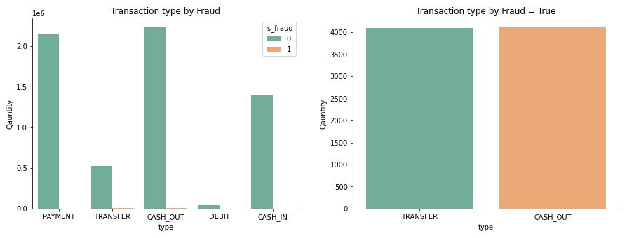
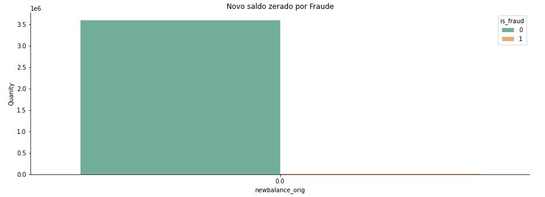
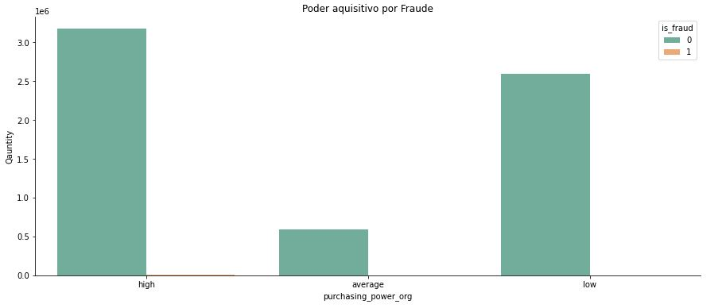
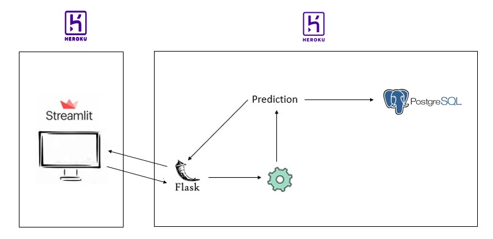
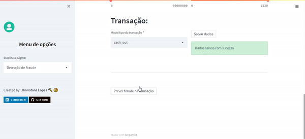

    

# Financial-Fraud-Detection

Previsão de interesse em um seguro de automóvel.

  

# Conteúdo

<!--ts-->

1.  [Contexto do Problema](Contexto-do-Problema)
2.  [O Problema](O-Problema)
3.  [Entendimento do Problema](Entendimento-do-Problema)
4.  [Dados](Descrição-de-Dados)
5.  [Planejamento da Solução](Planejamento-da-Solução)
6.  [Hipóteses Principais](Hipóteses-Principais)
7.  [Algoritmos ML](Algoritmos-de-Machine-Learning-Aplicados)
8.  [Performace Modelos](Performace-dos-Modelos-de-Machine-Learning)
9.  [Resultados](Resultados)
10. [Entrega da Solução](#Entrega-da-Solucao)

<!--te-->

# Contexto do Problema

A **Blocker Fraude Company** é uma empresa especializada na detecção de fraudes em transações financeiras feitas através de dispositivos móveis. A empresa tem um serviço chamado “Blocker Fraud” no qual garante o bloqueio de transações fraudulentas.

E o modelo de negócio da empresa é do tipo Serviço com a monetização feita por performance do serviço prestado, ou seja, o usuário paga uma taxa fixa sobre o sucesso na detecção de fraude das transações do cliente.

Porém, a Blocker Fraud Company está em fase de expansão no Brasil e para adquirir clientes mais rapidamente, ela adotou uma estratégia muito agressiva. A estratégia funciona da seguinte forma:

1. A empresa vai receber 25% do valor de cada transação detectada verdadeiramente como fraude.
2. A empresa vai receber 5% do valor de cada transação detectada como fraude, porém a transação é verdadeiramente legítima.
3. A empresa vai devolver 100% do valor para o cliente, a cada transação detectada como legítima, porém a transação é verdadeiramente uma fraude.

Com essa estratégia agressiva a empresa assume os riscos em falhar na detecção de fraude e é remunerada na detecção assertiva das fraudes.

Para o cliente, é um excelente negócio contratar a Blocker Fraud Company. Apesar da taxa cobrada ser muito alta sobre o sucesso, 25%, a empresa reduz seus custos com transações fraudulentas detectadas corretamente e ainda o prejuízo causado por um erro do serviço de anti-fraude será coberto pela própria Blocker Fraud Company.

Para a empresa, além de conseguir muitos clientes com essa estratégia arriscada em garantir o reembolso no caso de uma falha na detecção de fraude do cliente, ela depende somente da precisão e da acurácia dos modelos construídos pelos seus Cientistas de Dados, ou seja, quanto mais preciso for o modelo “Blocker Fraud”, maior o faturamento da empresa. Porém, se o modelo tiver baixa precisão, a empresa poderá ter um prejuízo enorme.

# O Problema

Você foi contratado como um Consultor de Ciência de Dados para criar um modelo de alta precisão e acurácia na detecção de fraudes de transações feitas através de dispositivos móveis.

Ao final da sua consultoria, você precisa entregar ao CEO da Blocker Fraud Company um modelo em produção no qual seu acesso será feito via API, ou seja, os clientes enviarão suas transações via API para que o seu modelo as classifique como fraudulentas ou legítimas.

Além disso, você precisará entregar um relatório reportando a performance e os resultados do seu modelo em relação ao lucro e prejuízo que a empresa terá ao usar o modelo que você produziu. No seu relatório deve conter as respostas para as seguintes perguntas:

1. Qual a Precisão e Acurácia do modelo?
2. Qual a Confiabilidade do modelo em classificar as transações como legítimas ou fraudulentas?
3. Qual o Faturamento Esperado pela Empresa se classificarmos 100% das transações com o modelo?
4. Qual o Prejuízo Esperado pela Empresa em caso de falha do modelo?
5. Qual o Lucro Esperado pela Blocker Fraud Company ao utilizar o modelo?

# Entendimento do Problema

**Motivação:** Alta estratégia de crescimento para expansão sobre os resultados de detecção das fraudes.

**Causa Raiz do Problema:** Criar um modelo capaz de detectar fraudes com alta acuracia.

**Tipo de Problema:** Detecção de Fraude.

**Potênciais Métodos:** Classificação.

**Granularidade:** Classificação de Fraude por Transação.

**Entraga da Solução:** WebApp contendo a predição e o Relatório.

**Dados para Resolver o Problema:** [Kaggle](https://www.kaggle.com/ealaxi/paysim1).

# Descrição de Dados

O Dataset usado para este projeto possui 381109 linhas e 12 colunas. Os dados contém:

| Atributo       | Significado                                         |
| -------------- | --------------------------------------------------- |
| step           | mapeia uma unidade de tempo no mundo real           |
| type           | Tipo da transação.                                  |
| amount         | valor da transação em moeda local.                  |
| nameOrig       | cliente que iniciou a transação.                    |
| oldbalanceOrg  | saldo inicial da origem antes da transação.         |
| newbalanceOrig | Saldo origem depois da transação.                   |
| nameDest       | cliente que é o destinatário da transação.          |
| oldbalanceDest | saldo inicial do destinatario antes transação.      |
| newbalanceDest | saldo do destinatario depois transação.             |
| isFraud        | target.                                             |
| isFlaggedFraud | Flag de fraude para transações maiores que 200 mil. |

# Planejamento da Solução

**1. Descrever os Dados:**

- Carregar os dados e entender as variáveis disponíveis e verificar possíveis valores faltantes e inconsistências.
- Realizar uma estatística descritiva para entender as características dos dados.

**2. Levantar Hipóteses:**

- Criar Hipóteses sobre as características e o comportamento de transações fraudulentas.
- Realizar uma Feature Engineering para criar novas variáveis.

**3. Filtrar Dados:**

- Filtrar linhas e colunas de acordo com as restrições de negócio e com as premissas assumidas.

**4. Realizar Análise Exploratória de Dados:**

- Validar ou refutar as hipóteses através dos dados.
- Identificar correlação entre variáveis e a variável resposta.
- Obter insights.

**5. Preparar os dados**

- Fazer o reescalonamento das variáveis e aplicar Encoding.

**6. Selecionar as melhores Features**

- Usar o algoritmo Extra Trees para selecionar as features mais importantes e low variance.

**7. Modelagem de Machine Leaning**

- Treinar, aplicar cross validation nos algoritmos e validar a partir de métricas apropriadas.

**8. Ajustar os Hiperparametros**

- Encontrar a melhor combinação de parametros para o modelo final usando a técnica de Random Search.

**9. Traduzir e Interpretar o erro**

- Transformar a performace de Machine Leaning para resultado de Negócio, respondendo as perguntas de negócio feitas.

**10. Deploy do Modelo em Produção**

- Deixar o modelo acessível utilizando API e com acesso via webApp.

# Hipóteses Principais

### H1. Fraudes acontecem mais em transações de débito.

**FALSA** Fraudes acontecem mais em transações de <ins>Transferencia</ins> e <ins>Cash Out</ins>.

  

### H4. Contas de origem que ficaram zeradas após as transações, são fraudes.

**FALSA** A maior parte das transações em que o saldo final da conta de origem ficou zerada, não foi fraude.

  

### H5. Há maior quantidade de fraudes em contas de pessoas com alto poder aquisitivo.

**VERDADEIRA** Há maior quantidade de fraudes em contas de pessoas com <ins>alto</ins> poder aquisitivo.

  

# Algoritmos de Machine Learning Aplicados

Os modelos treinados foram:

- Modelo Baseline
- Naive Bayes
- Logistic Regression
- Random Forest
- LGBM

O modelo com performance mais alta e escolhido para resolver o problema de Fraude da empresa foi o **LGBM**.

# Performace dos Modelos de Machine Learning

As métricas usadas para comparação dos resultados foram: Balanced Accuracy, Precision e Recall. Os resultados das performances obtidas com a validação cruzada foram:

| Model Name          | Balanced_accuracy | Precision        | Recall           |
| ------------------- | ----------------- | ---------------- | ---------------- |
| Baseline            | 0.5 +/- 0.0       | 0.0 +/- 0.0      | 0.0 +/- 0.0      |
| Naive Bayes         | 0.88 +/- 0.00022  | 0.77 +/- 0.0003  | 0.98 +/- 0.00012 |
| Logistic Regression | 0.97 +/- 0.00035  | 0.92 +/- 0.00075 | 1.0 +/- 7e-05    |
| Random Forest       | 0.98 +/- 0.0034   | 0.96 +/- 0.00824 | 1.0 +/- 0.0001   |
| LGBM                | 0.99 +/- 9e-05    | 0.97 +/- 0.00023 | 1.0 +/- 0.00028  |

# Resultados

## Respondendo Perguntas do Negócio

### 1. Qual a Precisão e Acurácia do modelo?

- O modelo tem **98.6%** de acurácia.

### 2. Qual a Confiabilidade do modelo em classificar as transações como legítimas ou fraudulentas?

- Em cerca de 1 Milhão de transações, o modelo conseguiu acertar **99.55% das fraudes**.

### 3. Qual o Faturamento Esperado pela Empresa se classificarmos 100% das transações com o modelo?

- Em 1 Milhão de transações, se classificarmos 100% das Fraudes, o faturamento esperado é de **93 Milhões e 477 mil**.

### 4. Qual o Prejuízo Esperado pela Empresa em caso de falha do modelo?

- A cada 1 Milhão de transações o **modelo erra 0.5%** e de 1.329 transações Fraudulentas o **modelo erra 7**.

### 5. Qual o Lucro Esperado pela Blocker Fraud Company ao utilizar o modelo?

- Em 1 Milhão de transações, o <ins>lucro bruto</ins> é de 93 Milhões e 392 Mil e o <ins>lucro líquido</ins> por devolver 100% do valor aos 7 clientes é de **93 Milhões e 59 Mil**.

# Entrega da Solução

## Arquitetura Modelo em Produção

  

## Demonstração do Modelo

Acesse os resultados do modelo em produção [aqui](https://streamlit-fraud-detection.herokuapp.com/)

  

